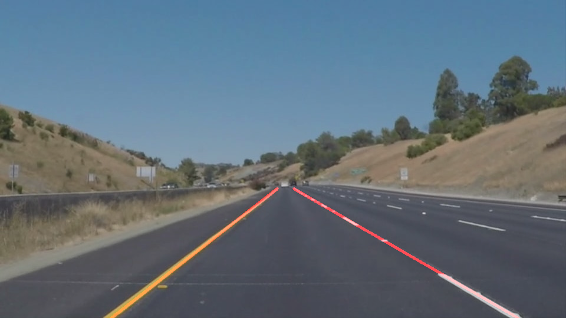

# **Finding Lane Lines on the Road** 

---
### Reflection
---

### My pipeline consisted of the following steps:

Grayscale conversion  

Smoothing edges with Gaussian Blur

Canny-edge detection algorithm with 60-low threshold and 180-high threshold

Region mask

Hough-space transform and extrapolated lines

draw_lines function was modified:
First I calculate the slope of the line segments. If the slope is positive then it is the right line. If it's negative it's the left line.
For each line, I calculate 2 points using the average x and y values from the line segments that are in the image.
Using these 2 points it's possible to get the slope and y-intercept of the line.
Then I extrapolate this line and extend it to be 1 continuous line through the line segments.

Then I use the weighted image function to overlay this line on the original image and this produces the final image.

  

Applying this function to every frame of a video produces the following:

### Short-comings
The extrapolated line at the end is jittery and does not display smoothly on the video. 

The edge detection algorithm also has trouble with shadows, and curves, and if the front of the car is seen, it's included in the image.

### Areas for improvement:
A area of improvement would be to have a more sophisticated algorithm for the extrapolation of the line segments, thus smoothing out the jittery movements on the video.
Another improvement would be changing the region mask dynamically so as the road curves, the mask also changes.

Another improvement would be some way to disregard the hood of the car.

