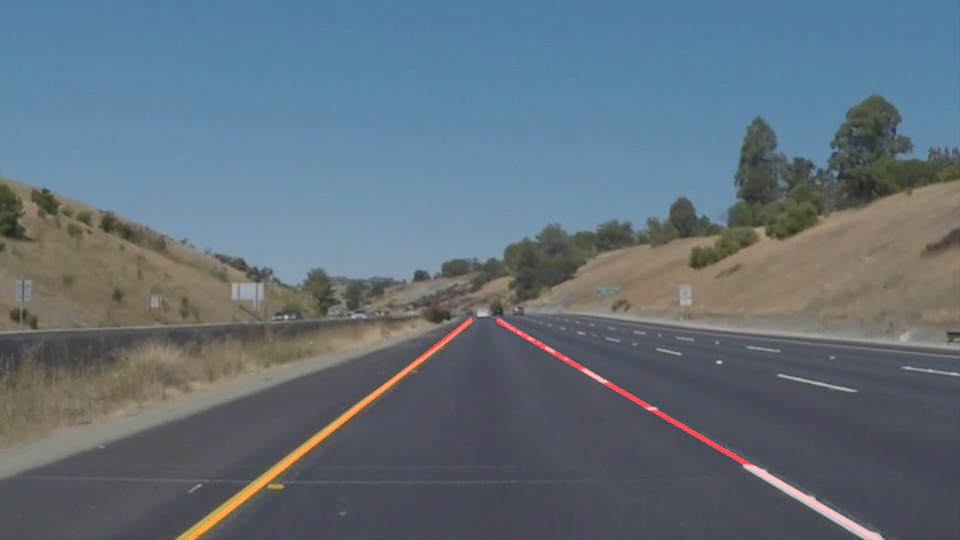

# **Finding Lane Lines on the Road** 

---
### Reflection
---

### My pipeline consisted of the following steps:

I converted the image to grayscale and smoothed the edges by applying a gaussian blur.

Then I applied the canny edge detection algorithm with a 60-low and 180-high threshold.

I applied a mask to this image to focus on a specific region, which disregards areas I don't want.

Then I applied the Hough space transform to draw the corresponding line segments. 

I modified the draw_lines function in the following way: 
First I calculate the slope of the line segments in a single frame. If the slope is positive then it is the right line. If it's negative it's the left line.
For each line, I calculate 2 points using the average x and y values from the line segments that are in the image.
Using these 2 points it's possible to get the slope and y-intercept of the line.
Then I extrapolate this line and extend it to be 1 continuous line through the line segments.

Then I use the weighted image function to overlay this line on the original image and this produces the final image.

### Short-comings
The extrapolated line at the end is jittery and does not display smoothly on the screen. 

The edge detection algorithm also has trouble with shadows, and if the front of the car is seen, it's included in the image.

### Areas for improvement:
A area of improvement would be to have a more sophisticated algorithm for the extrapolation of the line segments, thus smoothing out the jittery movements of the line.
Another improvement would be the ability to differentiate between shadows and the road.

Another improvement would be some way to disregard the hood of the car

